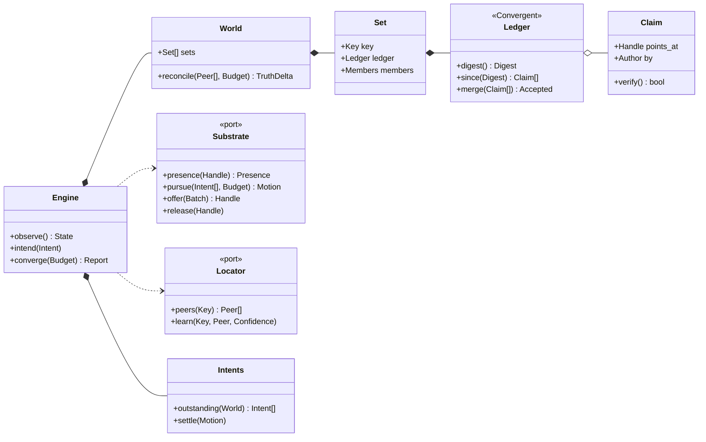

# The Portalis engine

Status: **design, not implemented.** Supersedes `engine-v3.md`.

---

## 1. What it is

> **Portalis makes a set of bytes exist in more than one place, with proof of
> who put it there, and no server.**

Anything in the codebase that cannot be traced to that sentence does not belong
in it.

---

## 2. What shape it has: a reconciler

There is a **desired state** — the claims collaborators have signed, and what
this device has decided it wants. There is an **observed state** — which bytes
are actually here, and which peers are actually reachable right now. One loop
closes the gap, forever, and is allowed to fail at any point.

That shape has a name, and the name matters, because it settles a dozen
arguments before they start:

> **The engine is level-triggered, not edge-triggered.**
> It acts on the *difference* between desired and observed, never on the
> *event* that caused the difference.

Every serious bug in this project so far was edge-triggered logic:

| Bug | The edge that was missed |
|---|---|
| Join never synced again after the first attempt | the one sync was fired *by* the join |
| A fetch that found no peer hung forever | the fetch was fired *by* the tap |
| A peer's saved address died on its restart | the address was learned *by* an exchange |
| Media never propagated after joining | nothing re-derived the difference |

None of those is a coding mistake. They are all the same design mistake, made
four times. A level-triggered engine cannot express them: there is no "the sync
that was fired by the join", there is only *this set's truth differs from that
peer's*, which is still true on the next pass, and the next.

The corollary is the performance story too — see §5.

---

## 3. Three universals

The sentence in §1 contains exactly three kinds of thing, and **they fail
independently**:

| | Is | Fails by |
|---|---|---|
| **Truth** | what is claimed, and by whom | arriving out of order, or forged |
| **Substance** | the bytes a claim points at | being large, slow, or not here yet |
| **Reach** | whether two devices can talk *now* | NAT, Wi-Fi, permissions, restarts |

A ledger can be complete while the bytes are absent. Bytes can be present while
nothing is reachable. A peer can be reachable while its truth is stale. Three
independent failures, three mechanisms, one loop.

The present code never named them, so each was solved several times: **seven
retry policies, four address caches, two "what do I have" joins.**

---

## 4. The nouns, and the loop



```rust
async fn converge(&self, budget: Budget) -> Report {
    let peers = self.locator.peers(self.world.keys()).take(budget.fanout);
    let truth = self.world.reconcile(peers, budget).await;
    let motion = self.substrate.pursue(self.intents.outstanding(&self.world), budget).await;
    self.intents.settle(&motion);
    Report::of(truth, motion)
}
```

Five statements, and it is the whole engine. If a feature cannot be expressed as
a change to `World`, `Substrate`, `Locator`, `Intents` or `Report`, the model is
wrong — not the feature.

**Where "generic" lives.** Not in the transports; those are ordinary ports. The
engine is generic over **`Convergent`** — what it means for two replicas to
agree. Today that is a grow-only signed set. Tomorrow it can be one with
tombstones, or with revocation, and `converge()` does not change. That is the
axis along which this system will actually need to grow (§7).

### Invariants the loop must hold

| Invariant | Why it exists |
|---|---|
| **Idempotent** | a pass that runs twice does nothing extra; retries are free |
| **Order-free** | claims merge commutatively — already true of the signed set |
| **Interruptible** | a pass may stop anywhere; the next re-derives the difference |
| **Bounded** | every pass takes a `Budget` and respects it |
| **Total** | a pass never fails; it returns a `Report` containing failures |

The last one is deliberate. Convergence has no error return, because "this peer
was unreachable" is not an error — it is the normal condition of a distributed
system, and it belongs in the report the UI renders.

---

## 5. Performance — a consequence, not an afterthought

A level-triggered reconciler's cost is **proportional to the difference, not to
the state.** That single property is where the performance comes from; the three
mechanisms below are just how it is realised.

### The cost that exists today

`list_collections` runs on the UI poll — every second while the app is in front
of you. Each call, per collection: takes the store lock, hex-encodes a fresh
invite code, scans every collaborator record for a stale nickname, walks every
manifest entry, joins it against the live session, and builds a `MediaInfo` for
**every file of every torrent**. The whole tree then crosses FFI and every
listening widget rebuilds.

For twenty collections of thirty entries averaging twenty files, that is
**twelve thousand DTOs per second** marshalled across the boundary — to paint a
list showing six rows and a progress bar.

Sync has the matching shape: every 45s, for each collection, for each of up to
twelve remembered addresses, the **entire** manifest is serialised both ways
whether or not anything changed. O(entries × peers × collections), forever, in
the overwhelmingly common case where nothing changed at all.

### The three mechanisms

**1. Push a delta, don't pull a snapshot.**
`converge()` returns a `Report` of what changed. The UI subscribes to reports
instead of asking "what is everything?" once a second. An idle app costs zero
FFI calls and zero rebuilds — today it costs one full traversal per second
forever. (The backend README specified "push, not poll" and it was never built.)

**2. Digest before payload.**
`Ledger::digest()` is a constant-size summary. An exchange sends the digest
first and the claims only on mismatch. The common case — nothing changed —
falls from kilobytes per peer per collection to a hundred bytes. `since(Digest)`
then sends only the claims the peer lacks.

**3. Project what is on screen.**
The list needs a name, a presence, a progress and a countdown. It does not need
every file of every entry. Projections are per-view and lazy; the file list is
built when a collection is opened.

### Scaling axes

Naming the axes separately is what stops "make it fast" being a mood.

| Axis | Today | With this model |
|---|---|---|
| collections **N** | O(N) full projection every second | O(changed) pushed |
| entries per set **E** | full ledger on the wire every 45s | digest, then O(missing claims) |
| files per entry **F** | every file in every poll | projected on demand |
| peers per set **P** | serial dial, 5s timeout each, up to 12 | bounded fanout *k*, confidence-ordered, parallel |
| devices per set **D** | everyone dials everyone → O(D²) per round | epidemic: fanout *k* converges in O(log D) rounds |
| content size **B** | librqbit's problem | unchanged — correctly, it is good at this |

### Budget

Every pass takes a `Budget` — a wall-clock slice, a fanout cap, a claim cap.
This is what makes the loop safe at the top of those axes: five hundred
collections cannot stall a tick, they simply take several passes, and because
the loop is level-triggered, taking several passes is not a special case that
needs code.

**Cost of the abstraction, stated plainly:** `Arc<dyn Trait>` is one vtable hop,
`#[async_trait]` is one box per port call. Against a poll that currently
marshals twelve thousand structs a second, this is not measurable.

---

## 6. The seams

A port exists for exactly one reason: **a universal whose implementation is
unreliable or replaceable.** Five, because there are three universals, one
persistence concern, and time.

| Port | Universal | Exists because |
|---|---|---|
| `Substrate` | Substance | BitTorrent today; `Handle` is opaque precisely so this can change |
| `Locator` | Reach | invite addresses now, DHT next — today there is no seam at all |
| `Channel` | Truth | TCP now; a loopback impl converges two engines inside one test |
| `Vault<T>` | persistence | four hand-rolled atomic JSON writers become one |
| `Clock` | intents age | retry logic stops needing real time to be tested |

```
kernel/    Set, Ledger, Claim, Handle, Presence, Intent, Report, Budget,
           identity, invite — pure, no I/O, no statics
ports/     Substrate, Locator, Channel, Vault<T>, Clock
adapters/  TorrentSubstrate · InviteLocator · DhtLocator · TcpChannel ·
           JsonVault<T> · SystemClock    (+ Memory*/Loopback* fakes)
engine.rs  Engine — observe / intend / converge
view/      projections for the FRB boundary
```

One-way dependencies: `kernel` ← `ports` ← `engine`; `adapters` → `ports`;
nothing depends on `adapters` but the composition root.

---

## 7. What a future change costs

The test of an architecture is the price of the next thing, not the elegance of
the current thing. The README's open questions, priced:

| Future work | Cost under this model |
|---|---|
| DHT rendezvous (Phase 3) | one `Locator` adapter; loop unchanged |
| A relay for hostile NATs | one `Locator` + one `Channel`; loop unchanged |
| Something other than BitTorrent | one `Substrate`; `Handle` already opaque |
| **Removing media / revoking a collaborator** | a `Convergent` with tombstones — the open question the README calls unanswerable today, because a grow-only set has no "remove". Under this model it is a new `Ledger`, not a redesign. |
| Multi-device identity | a claim type; `Members` becomes a `Convergent` too |
| Selective sync (don't fetch everything) | already expressible — an `Intent` that is never raised |
| Web, view-only | a `Substrate` that can only read |

Every row is an adapter or a `Convergent`. None is a change to the loop. That is
the property being bought.

---

## 8. The rule

**No function body over five statements.** When it trips, an object is missing;
the fix is to name what the body was implicitly doing, never to halve it.

Counting: `let`, assignment, call, `return`, and a whole `if`/`for`/`match` count
one each. Signature, braces, `use`, attributes, doc comments do not. A struct
literal is one statement whatever its field count. A `match` whose arms are
single expressions is one statement. Exempt: generated `api.rs`, test bodies.

Applies to Dart on the same terms — a `build()` returning one `Column` of fifteen
children is one statement, so it bites logic and leaves widgets alone.

| Today | Statements | The object it is asking for |
|---|---|---|
| `list_collections` | ~100 | `Presence` + per-view projections |
| `enumerate_lan_ips` | ~40 | `InterfaceScan`: candidates / rank / dedupe |
| `apply_message` | ~40 | `Accepted` (a merge report) |
| `fetch_pending` | ~35 | `Intent` |
| `session()` | ~50 | `From<EngineSettings> for SessionOptions` |
| `delete_collection` | ~30 | `Intents::retract` + `Substrate::release` |

---

## 9. What becomes testable

`Ports` is a struct, so a test builds one — no socket, no disk, no globals:

```
Ports { substrate: MemorySubstrate, locator: MemoryLocator,
        channel: LoopbackChannel, vault: MemoryVault, clock: FixedClock }
```

Then, in-process: two engines converge on the same ledger; an acquire intent
survives having no reachable peer and completes when one appears; a released
handle stays if another set still claims it; a forged claim is refused *and
named in the report*; a rename reaches the peer on the next pass; a budget of
one peer converges D devices in O(log D) passes.

Every one of those is a bug fixed by hand in the last week. **Today there are 51
backend tests and every one covers a pure function** — `join`, `sync`, `fetch`
and `delete` have none, because they need real sockets and eight process-wide
`static Mutex`es.

---

## 10. Getting there

Strangler, with a stop after every step. The sharing path only just started
working end to end; it does not get thrown away in one commit.

| # | Step | Proves |
|---|---|---|
| 0 | **Pin today's behaviour** in tests that survive the move | the fixes are not silently lost |
| 1 | `kernel/`: `domain/` moves, `InfoHash` → `Handle`, `Presence` appears | pure rename, suites green |
| 2 | `ports/` + `JsonVault<T>` replaces four bespoke writers | one writer, four users |
| 3 | `TorrentSubstrate` wraps `torrent.rs` behind `Substrate` | the loop can be faked |
| 4 | `Intents` + `converge(Budget)`; seven retry policies collapse into one | level-triggered |
| 5 | `Report` pushed to Dart; the per-second poll dies | the performance claim |
| 6 | `engine.rs` is the FRB surface; old modules deleted | one way in |

Dart runs alongside: `EngineGateway` first (the only file permitted to import
`bridge_generated` — eight do today), then `Collections` splits into
store / loop / commands / importer, then `AppServices` as a settable composition
root and `debugSeed` is deleted. Widgets stay out of scope and keep calling a
stable accessor.

---

## 11. Non-goals and the one real risk

Not in scope: new features, Phase 3 itself (only its seam), widgets, and making
BitTorrent faster — librqbit is good at the part it owns.

**The risk:** a rewrite discards details, and the details *are* the last week's
fixes — a two-second timeout, a cached port, a case-insensitive hash compare, an
atomic rename. Step 0 exists for exactly this and is not optional: nothing moves
until the current behaviour is pinned by tests that will survive the move.
