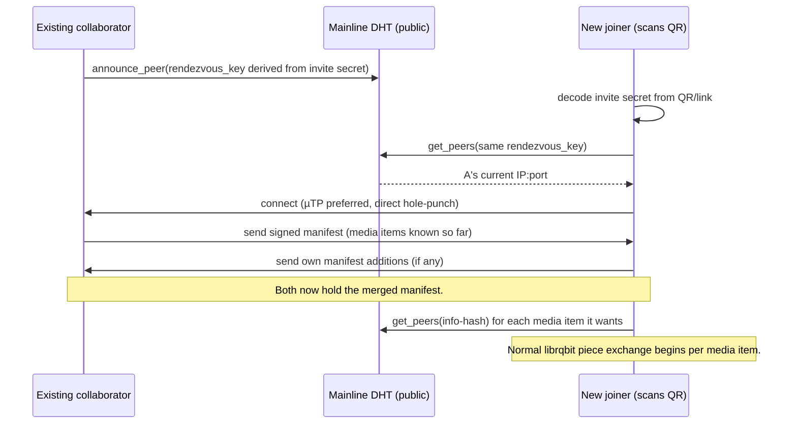
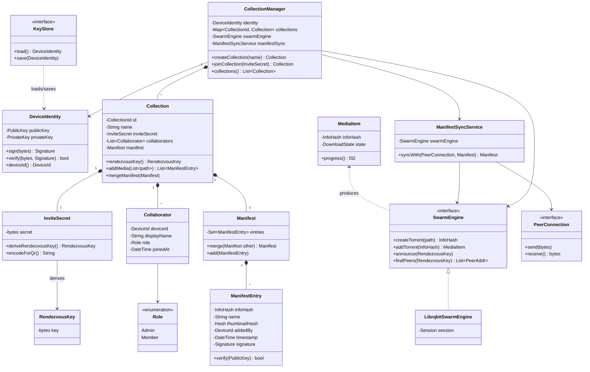
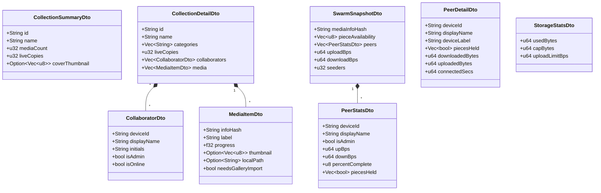

# Backend architecture

The Rust backend (`rust/backend`) is a `librqbit`-powered BitTorrent engine
wrapped in an app-specific layer that turns "swarms" into "collections":
growable, admin-curated, invite-only photo/video albums that sync
peer-to-peer with no server in the data path. This document is the big
picture; individual FRB bindings will get their own doc comments as they're
built.

## Why BitTorrent at all

SmartShare's pitch is "media never touches a server." BitTorrent already
solves the hard parts of that — chunked transfer, swarm-wide piece
availability, and (via its Mainline DHT) serverless peer discovery that
survives IP changes. Re-implementing that from scratch would mean
re-discovering the same bugs BitTorrent implementations spent two decades
fixing. See [decision record: crate selection](#appendix-why-librqbit) for
why `librqbit` specifically.

What BitTorrent does **not** give us, and what this backend has to build on
top:

- a concept of a "collection" that **grows over time** (BitTorrent torrents
  are immutable once their info-hash is computed)
- collaborator identity, roles (admin vs. member), and invite/join flows
- a name for "this specific album" that isn't tied to any one file's content

## Core concepts

| Concept | What it is | Where it lives |
|---|---|---|
| **Device identity** | An Ed25519 keypair generated on first launch. The public key *is* the device's identity — no accounts, no servers. | Local keystore (see [Open questions](#open-questions)) |
| **Collection** | A named, growable album with an invite secret, a set of collaborators, and a set of media items. | App-level manifest (proposed design below) — **not** a single torrent |
| **Media item** | One photo/video. Each one is its own BitTorrent torrent (own info-hash, own piece set). | `librqbit::Session` manages these directly |
| **Swarm** | The set of peers currently reachable for a given torrent (a media item) or, virtually, for a collection's rendezvous key. | `librqbit` (per-media-item) + our own peer-set (per-collection) |
| **Invite secret** | A random value minted when a collection is created; encoded in the QR/link. Derives the collection's DHT rendezvous key. Knowing it is what makes you a collaborator. | Embedded in invite link/QR |

## Why "collection" can't just be "a torrent"

A torrent's info-hash is a hash of its piece layout — fixed forever at
creation. But the mockup's core interaction is *"100 people keep adding
media to this collection over months."* That's fundamentally a mutable,
multi-writer structure, which BitTorrent was never designed to express.

**Proposed design** (flagging this for sign-off — it's the one real fork in
this document, everything else follows directly from earlier decisions):

1. A collection's invite secret derives a stable **rendezvous key** —
   peers `announce_peer`/`get_peers` on this key via the Mainline DHT (BEP-5)
   exactly like we discussed for the "IP changes" problem, just one level up
   from individual media items.
2. Once two collaborators' clients find each other via that rendezvous key,
   they exchange a small **manifest**: an add-only, signed list of `{media
   item info-hash, name, thumbnail hash, added-by device key, timestamp}`
   entries. Each entry is signed by the contributor's device key, so the
   manifest can be merged from multiple peers without a central authority —
   a simple CRDT (grow-only set), gossiped peer-to-peer alongside normal
   swarm traffic.
3. Each peer locally decides which media items (torrents) from the merged
   manifest to actually fetch/seed — e.g. "everything," or "only what I've
   opened," depending on storage settings (ties into the Settings screen's
   storage cap).
4. `librqbit::Session` handles the actual piece exchange per media item, as
   normal BitTorrent. The manifest sync is the one piece of custom protocol
   this backend needs to write.

This keeps 95% of the hard networking work inside `librqbit` and confines
custom protocol code to one narrow, well-understood problem (a signed
grow-only set), rather than reinventing swarm mechanics.

## How joining a collection works, end to end



## Code design

Rust has no classical inheritance, so "object-oriented" here means the
idiomatic Rust equivalent: **traits as interfaces, structs as classes,
composition over inheritance**, and dependency inversion at the boundaries
that matter — specifically, the domain model (`Collection`, `Manifest`,
`DeviceIdentity`) never depends on `librqbit` or a platform keystore
directly. It depends on small traits (`SwarmEngine`, `KeyStore`,
`PeerConnection`); concrete adapters implement those traits. That's what
makes "swap the relay strategy later" or "test the manifest merge logic
without a real socket" possible without a rewrite.

Proposed module layout:

```
src/
  domain/       DeviceIdentity, Collection, Manifest, ManifestEntry,
                Collaborator, Role, MediaItem — no I/O, fully unit-testable
  ports/        trait SwarmEngine, trait KeyStore, trait PeerConnection
  adapters/     LibrqbitSwarmEngine, platform KeyStore impls
  services/     ManifestSyncService — orchestrates ports to do real work
  collection_manager.rs   Facade: the one type FRB bindings actually call
```



`CollectionManager` is the only type FRB bindings talk to (a Facade) — this
keeps the generated glue thin and keeps `librqbit` types from leaking into
`lib.rs`'s public surface at all.

**Open design question this raises:** should `Collection`/`Manifest` be
plain data (owned by `CollectionManager`, mutated through it) or should they
carry behavior and be handed out as shared handles (`Arc<Collection>`) that
the Flutter side holds onto directly via FRB's opaque-type support? The
diagram above assumes the former (simpler, `CollectionManager` as sole
mutator) — worth confirming before it's implemented.

## Flutter boundary API

None of the domain types above (`Collection`, `Manifest`, `MediaItem`...)
should cross the FRB boundary directly. Two reasons:

1. **Encapsulation** — the domain model is free to be refactored
   (e.g. changing how `Manifest` merges) without regenerating or breaking
   Dart bindings, as long as the DTO shape holds.
2. **The UI doesn't want the domain shape anyway.** The Flutter screens
   (already built against mock data in `lib/models.dart`) want flat,
   display-ready fields — `"6 copies alive"`, a 0.0–1.0 progress bar, a
   piece-heatmap byte array — not a `Manifest`'s CRDT internals.

So the boundary is a small set of **plain DTOs** (`Debug + Clone`, no
behavior, no `librqbit` types, no trait objects) plus a **Facade**
(`CollectionManager`) that's the only thing FRB generates bindings for.

### Push, not poll

Screens like the collection card's pulsing "copies alive" dot, the media
viewer's download progress, and the swarm heatmap all need to update
live as network state changes — polling from Dart would mean either
janky/late updates or wasteful tight-loop querying. flutter_rust_bridge's
`Stream<Item = T>` return type solves this the same way it would in
idiomatic Rust: the Facade method returns a stream, Rust pushes a new DTO
snapshot whenever the underlying state changes, Dart's `StreamBuilder`
does the rest. Every `watch_*` method below is one of these.

### DTOs



### Facade methods, mapped to the screens that consume them

| Method | Kind | Feeds |
|---|---|---|
| `create_collection(name)` | command → `CollectionSummaryDto` | Share flow, step 2 (after picking media) |
| `join_collection(invite_secret)` | command → `CollectionSummaryDto` | Deep link / QR scan handler |
| `invite_link(collection_id)` | command → `String` | Share flow, step 2 (QR/link display) |
| `add_media(collection_id, file_paths: Vec<String>)` | command → `Vec<MediaItemDto>` | Share flow, step 1 — always a batch, even for one file |
| `list_collections()` | query → `Vec<CollectionSummaryDto>` | Home, initial paint |
| `watch_collections()` | **stream** → `Vec<CollectionSummaryDto>` | Home (live "copies alive" updates) |
| `watch_collection(collection_id)` | **stream** → `CollectionDetailDto`, live per-item progress included | Collection detail screen (grid re-renders as any tile progresses) |
| `open_media(collection_id, info_hash)` | command | Media viewer (start/prioritize download on open) |
| `watch_media(info_hash)` | **stream** → `MediaItemDto`, live progress | Media viewer (download progress) |
| `confirm_media_imported(info_hash)` | command | Mobile only — Flutter calls this after it finishes saving into Photos/MediaStore, so Rust can delete the staging copy |
| `watch_swarm(info_hash)` | **stream** → `SwarmSnapshotDto` | Swarm screen (heatmap, collaborator list, speeds) |
| `watch_peer(collection_id, device_id)` | **stream** → `PeerDetailDto` | Peer detail screen |
| `device_identity()` | query → `CollaboratorDto` (self) | User screen |
| `storage_stats()` | **stream** → `StorageStatsDto` | Settings screen (bandwidth/storage meters) |
| `set_upload_limit(bps)` / `set_storage_cap(bytes)` | command | Settings screen toggles/sliders |

`watch_collection` and `watch_media` both carry live progress — decided:
both screens (grid and full-screen viewer) re-render straight off Rust
pushing updated DTOs, no polling either place.

## Media storage: Photos/MediaStore on mobile, Downloads on desktop

This is a real fork, not just a config option, because mobile and desktop
have fundamentally different storage models:

- **Desktop** — an ordinary filesystem. Rust can have `librqbit` write
  torrent pieces directly to their final destination
  (`~/Downloads/SmartShare/<collection name>/`, via the `dirs` crate for
  the platform-correct Downloads path) and be done. No Flutter involvement.
- **Mobile** — there is no "just write a file" for photos/videos. iOS
  sandboxes the filesystem and requires going through **PhotoKit**
  (`PHPhotoLibrary`) to add something to the Photos app; Android's scoped
  storage requires going through **MediaStore**. Neither is reachable from
  a plain filesystem write, and neither has a mature, well-maintained pure
  Rust wrapper worth depending on — this is squarely a platform-channel
  job, which Flutter already owns (e.g. via an existing plugin like `gal`
  or `photo_manager` on the Dart side).

So the flow differs by platform, expressed as a new port (parallel to
`SwarmEngine`, same pattern):

```
trait MediaStorageSink {
    fn staging_path(&self, item: &ManifestEntry) -> PathBuf;
    fn on_complete(&self, item: &ManifestEntry, staged_at: &Path) -> MediaStorageOutcome;
}

enum MediaStorageOutcome {
    SavedDirectly,                  // desktop: staging_path *was* the final path
    NeedsPlatformImport(PathBuf),   // mobile: Flutter must import this staged file
}
```

- `DesktopDownloadsSink` — `staging_path` returns the real Downloads
  subfolder path; `librqbit` writes there directly; `on_complete` is a
  no-op (`SavedDirectly`).
- `MobileStagingSink` — `staging_path` returns a path in the app's private
  cache/sandbox; `on_complete` returns `NeedsPlatformImport`, which is what
  populates `MediaItemDto.needs_gallery_import = true` and
  `local_path = Some(staging_path)` once progress reaches 1.0. Flutter
  sees that over `watch_media`/`watch_collection`, hands the path to a
  gallery-save plugin, and calls `confirm_media_imported(info_hash)` when
  done so Rust can reclaim the staging copy.

Desktop never sets `needs_gallery_import` — Flutter can ignore that field
entirely on macOS/Linux/Windows.

## Transport layers (recap of earlier decisions)

| Layer | MVP | Later |
|---|---|---|
| LAN discovery | mDNS (built into `librqbit`) | — |
| Internet discovery | Mainline DHT, key derived from invite secret (unguessable, no server) | — |
| Peer transport | µTP (NAT-friendlier than raw TCP), direct hole-punch only | Optional relay for peer pairs behind strict/symmetric NAT — the µTP seam makes this a drop-in later, not a rewrite |
| Piece exchange | Standard BitTorrent wire protocol, via `librqbit::Session` | — |
| Manifest sync | Custom, see above | — |

## Platform matrix (verified buildable, 2026-07-29)

| Platform | `librqbit` included? | Status |
|---|---|---|
| Android (arm64-v8a, armeabi-v7a, x86_64) | Yes | ✅ builds via `cargo-ndk` |
| iOS (device + simulator) | Yes | ✅ builds, packaged into `backend.xcframework` |
| macOS | Yes | ✅ builds |
| Linux / Windows | Yes | Not testable on this dev machine; CI covers native runners |
| Web (wasm32) | **No** — gated out in `Cargo.toml` | ✅ builds; Web is a viewer, not a swarm participant (browsers have no raw sockets, and `mio`/tokio's OS-poll layer doesn't support `wasm32-unknown-unknown` at all) |

## What's already decided vs. still open

Decided (from the earlier design conversation):
- Serverless via public Mainline DHT, unguessable derived keys for privacy
- LAN-first MVP, transport-agnostic core, relay as a later seam
- Real BitTorrent protocol via `librqbit`, not a custom wire format
- Web is view-only for now

### Open questions

Still open — will need answers before implementation goes much further:
- **Device identity storage**: where does the Ed25519 private key live on
  each platform (Keychain / Android Keystore / a plain encrypted file for
  desktop)? How does "losing all your devices loses your identity" (per the
  User screen copy) actually get backed up, if at all?
- **Admin/moderation semantics**: the mockup shows "2 admins" curating the
  cover image and implies some access control. A grow-only signed manifest
  has no natural way to *remove* a media item or revoke a collaborator —
  needs a tombstone/revocation scheme, or an explicit decision to punt on
  moderation for MVP.
- **Multi-device same-identity**: does linking a second device to the same
  person mean copying the private key, or issuing a second keypair with a
  signed "these are the same person" attestation?

## Appendix: why `librqbit`

Considered `librqbit` (chosen) vs. `cratetorrent` (rejected — Linux-only per
its own README) vs. a custom protocol over `quinn`/QUIC (rejected — would
mean re-solving piece selection, choking, and DHT discovery from scratch for
no real benefit). `librqbit` bundles BEP-5 DHT, mDNS, and µTP, is
Apache-2.0, actively maintained, and exposes a clean embeddable
`Session`/`create_torrent`/`AddTorrent` API rather than being CLI-first.
Full research trail is in the project conversation history.
