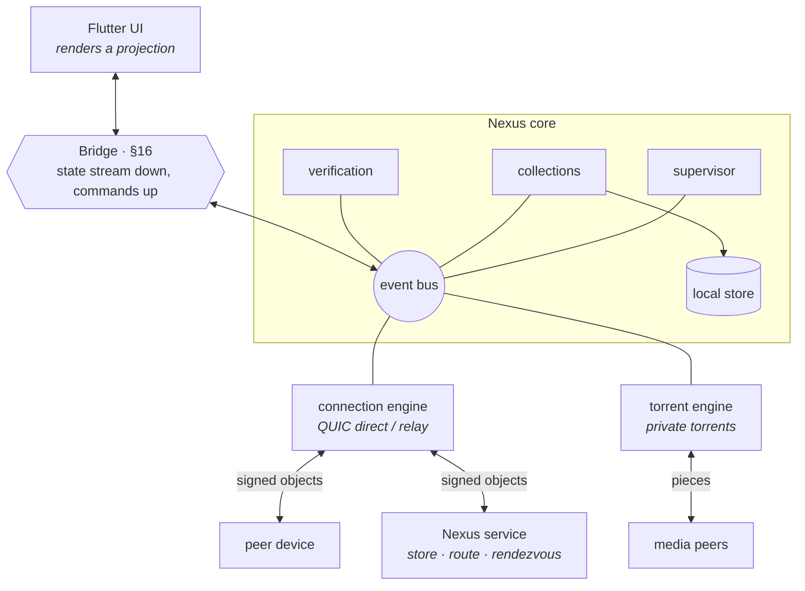
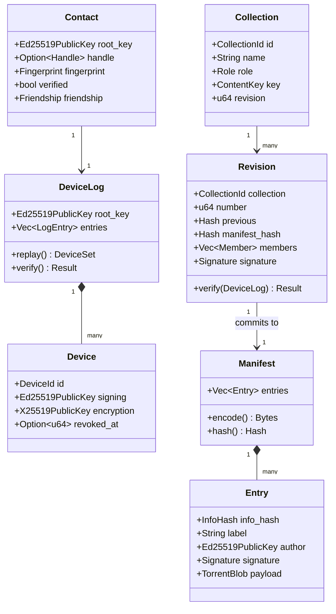
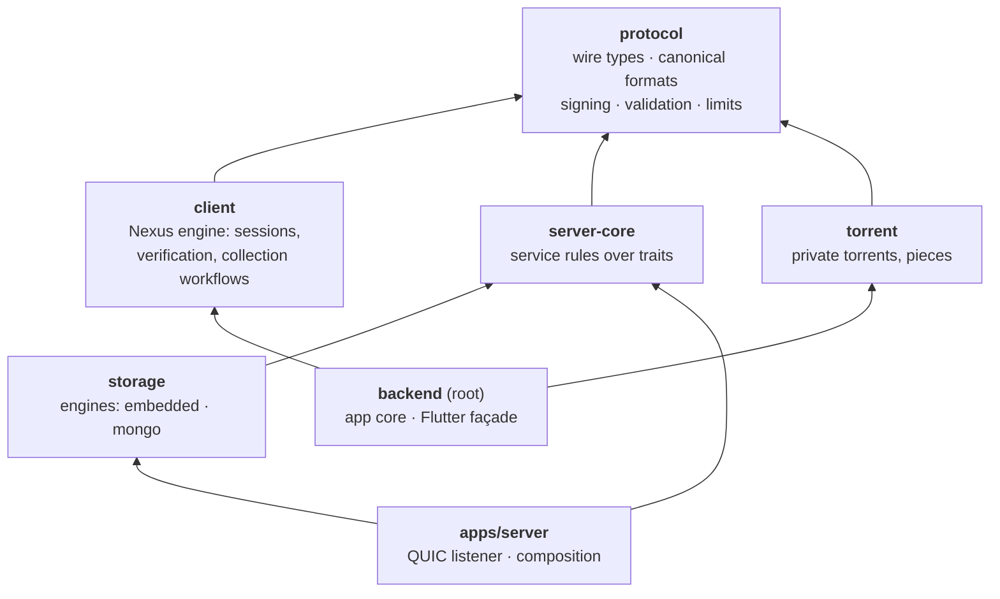
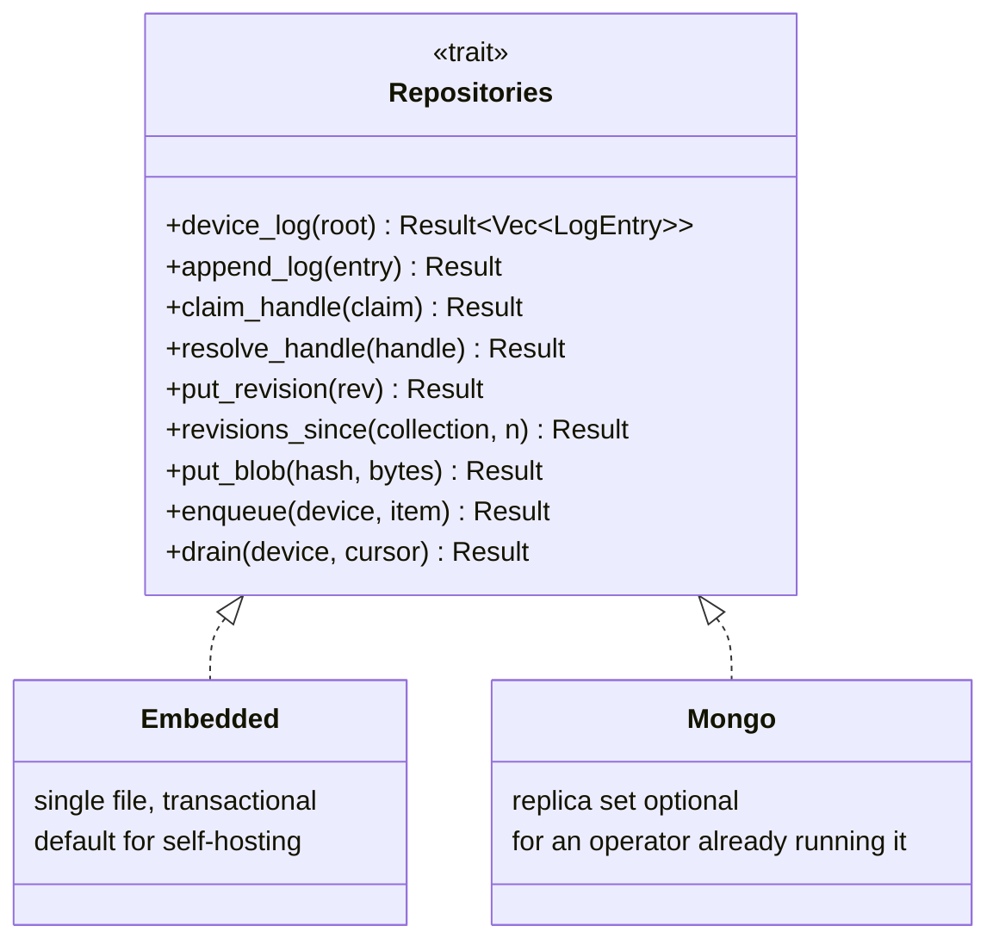
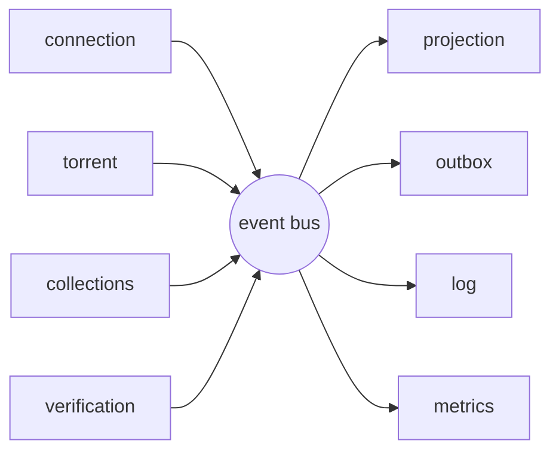
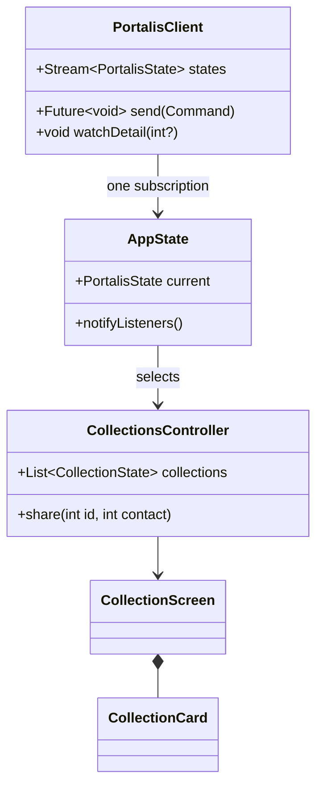
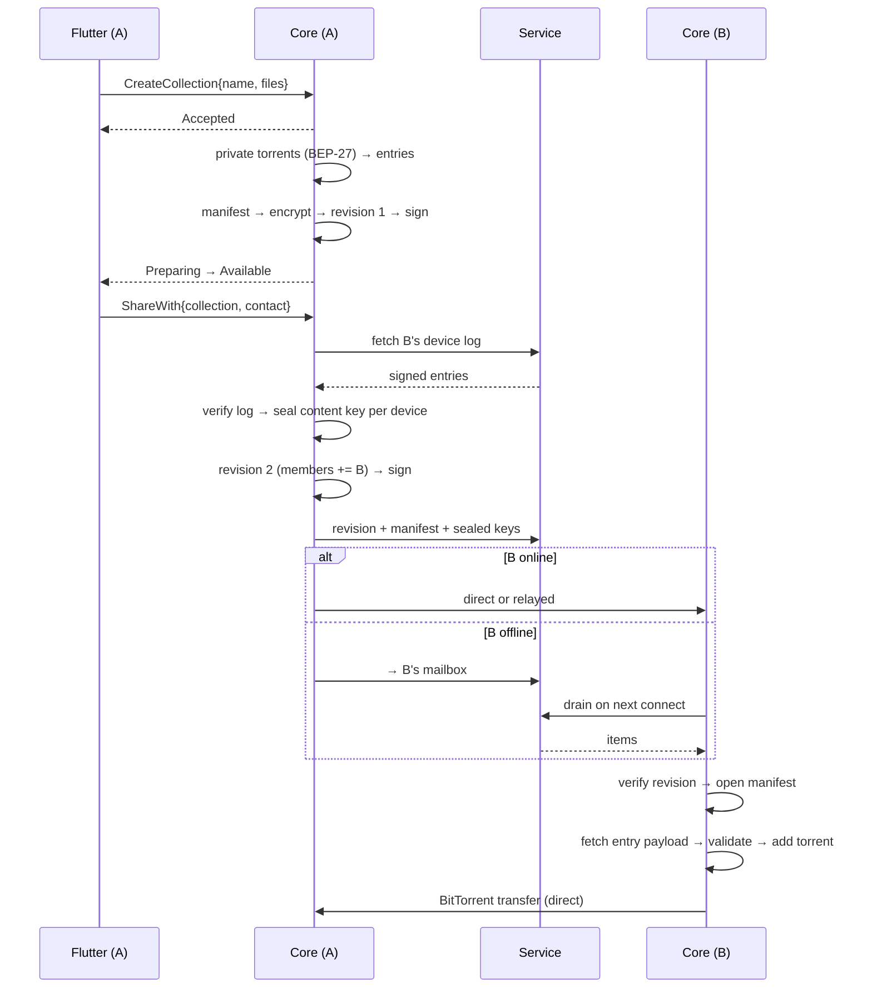
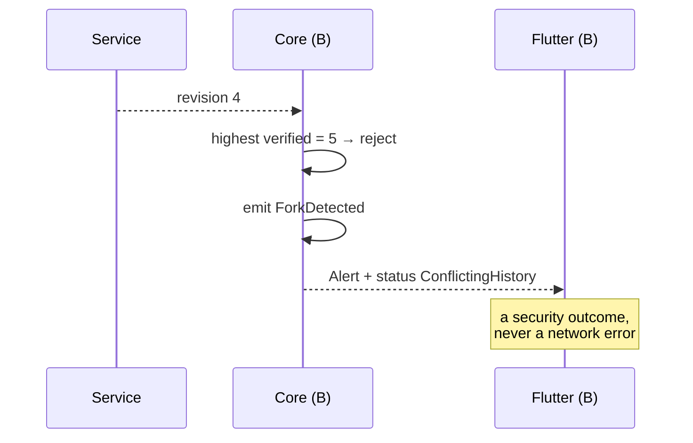
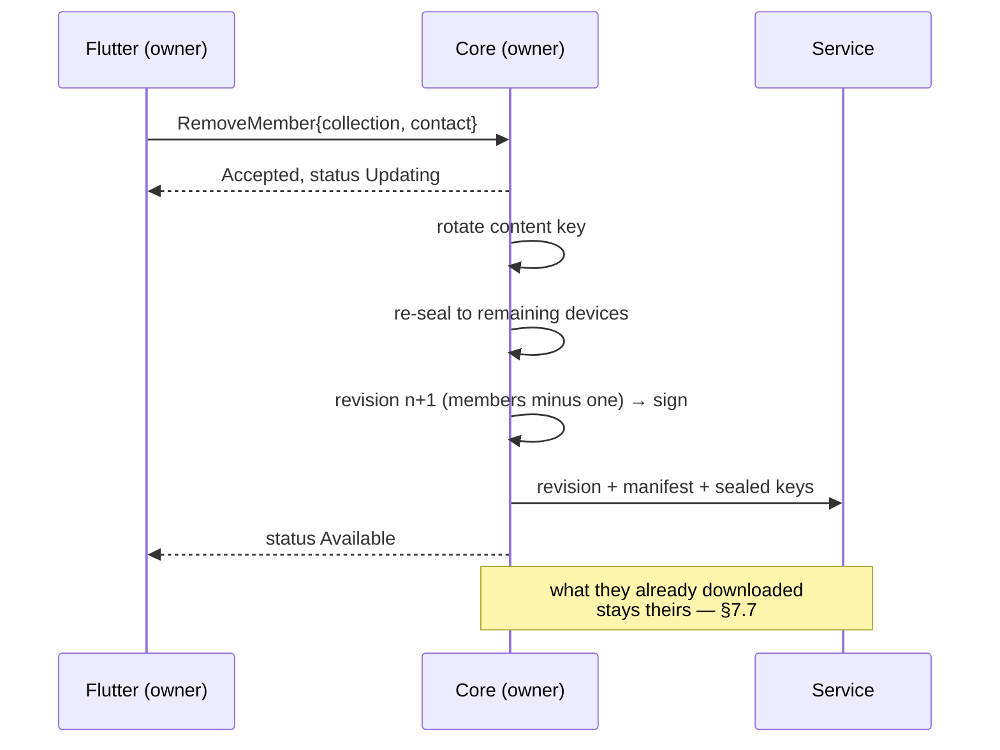

# Portalis v3 — Design and Specification

Portalis is a peer-to-peer application for sharing collections of photos and
videos with people you know. A Flutter interface sits over a Rust core that
owns identity, collections, connectivity and media transfer. A small service
helps devices find each other and holds what must survive while a device is
offline — and is trusted with none of it.

This document is the design: what exists, what shape it has, and why each
shape was chosen over the alternative. History lives in `CHANGELOG.md`. Where
this document and the code disagree, one of them is a bug.

Product version **v3** · wire protocol **`portalis.protocol.v1`** · clients on
macOS, iOS, Android and Linux · service on Linux.

---

# Part I — Product and decisions

## 1. What Portalis is

A person keeps collections of media and shares them with friends. Media moves
directly between devices over BitTorrent. What a collection contains, who may
read it, and how it changed are authored by the device that owns it, signed,
and encrypted.

| Property | Means |
|---|---|
| **Peer-to-peer** | Two devices on one network need no service at all |
| **Verifiable** | No server is trusted; every durable fact is signed and checked |
| **Private** | The service holds no key that opens anything; media never reaches it |
| **Responsive** | Local truth renders immediately; nothing visible waits on a round trip |

## 2. The whole vocabulary

Everything in Portalis is one of these. If a design needs a noun that is not
here, the design is probably wrong.

| Noun | Is | Lives |
|---|---|---|
| **Device** | one installation, holding two keypairs | on the device |
| **Device log** | the signed, append-only list of a person's devices | everywhere, verified |
| **Contact** | someone you have added, and their device log | locally |
| **Collection** | a named set of media you share | locally, published |
| **Revision** | one signed, chained state of a collection | locally, published |
| **Manifest** | the encrypted list of a revision's entries | inside a revision |
| **Entry** | one batch of media, and its private `.torrent` | inside a manifest |

Four things a user would recognise — contact, collection, revision, entry —
plus the cryptographic backing for two of them. There is no separate "share",
"head", "snapshot", "capsule" or "handoff"; each of those was a property of
one of the above wearing a noun's clothes.

## 3. Design decisions

Each row shaped the system. A decision is listed only if reversing it changes
more than one file.

| # | Decision | Rejected | Because |
|---|---|---|---|
| D1 | The service stores signed objects and routes; it decides almost nothing | Server-authoritative membership and revisions | A "P2P app" whose social state needs a trusted server is a client-server app |
| D2 | A person is a signed append-only **device log**, not an account row | Server-held device list | The dangerous attack is a service inventing a device so an owner seals a key to it. A log makes that impossible, not merely audited |
| D3 | A collection is a **chain of signed revisions** | Server-side compare-and-set as truth | Rollback and forks become detectable by any reader; the server's CAS is an optimisation, not correctness |
| D4 | Handles are a convenience with **fingerprint verification** | Trusting handle→key lookup | Lookup is exactly where the asker cannot verify. Comparing a fingerprint once is the only honest answer |
| D5 | Storage is a trait with **two engines**: embedded and MongoDB | One hard-wired database | A self-hoster wants one file; an operator already running Mongo wants Mongo. The service holds signed objects, so neither is load-bearing for correctness |
| D6 | Authenticated QUIC, direct-or-relay, from a maintained library | Custom TLS/TCP, WebSocket | NAT traversal, migration and relays are solved, and getting them wrong is expensive |
| D7 | One **event bus** inside the core; one **state stream** to Flutter | Direct calls between components; polling | Components stay decoupled and the projection has one input |
| D8 | Flutter derives and persists **no** state | Controllers holding computed history | Every derived value in Dart is a second source of truth waiting to disagree |
| D9 | Bridge payload split into **structure / progress / detail** | One snapshot type | Piece detail for every file at progress cadence is ~100× the necessary traffic |
| D10 | Canonical formats are hand-written, length-prefixed, domain-tagged | `bincode`, `postcard`, protobuf for canonical bytes | The format *is* the contract; a library that changes encoding changes every hash |
| D11 | A collection is many torrents, not one | One torrent replaced on every change | Re-hashing an entire collection to add one photo is unacceptable. This is the only reason a manifest exists |
| D12 | Private torrents carry BEP-27 `private`; no DHT, PEX or LSD | Public swarm, obscure info hashes | Confidentiality rests on info-hash secrecy; announcing spends it permanently |
| D13 | Media payloads are **not** encrypted at rest in v3 | Per-share payload encryption | Deliberate and weaker; stated openly (§9.6) with a version byte reserving the upgrade |
| D14 | Cryptography from RustCrypto and dalek | Hand-rolled primitives | Already true; listed so it stays true |
| D15 | Crates exist only at link boundaries | A crate per concern | Ten crates with one consumer each buy nothing and cost ten manifests |

---

# Part II — Architecture

## 4. System view



Two devices on one network need no service: they connect directly, exchange
signed revisions and sealed keys, and transfer media. The service exists for
reaching a device across networks and delivering to one that is offline.

## 5. Trust

This section governs the document. Where a later section appears to grant the
service authority, this section wins.

| The service can | Mitigation | Residual cost |
|---|---|---|
| Withhold or delay | Indistinguishable from offline, which is handled | Delivery latency |
| Observe metadata | None claimed (§6) | The operator sees the social graph |
| Lie about presence | Presence is a hint; nothing depends on it | A wasted connection attempt |
| Lie about handle→key | Fingerprint comparison (D4) | Contact shows *unverified* until compared |

| The service cannot | Because |
|---|---|
| Forge a revision or log entry | Signed; author checked against the device log |
| Read a manifest or media | Manifests are encrypted; media never reaches it |
| Roll back undetectably | Hash chain, plus the highest revision seen is persisted |
| Insert a device | The device log is append-only and signed (D2) |

Verification is not a setting. A client rejects what it cannot verify and
treats a fork or rollback as an alert, never as something to merge.

## 6. Non-goals

- The service does not store or relay media payloads.
- Portalis does not hide *who talks to whom* from the operator. Metadata
  privacy at that level needs a different transport and is not claimed.
- v3 needs no horizontal scaling, browser client, or admin interface.
- Discovery does not guarantee reachability, which is why relay exists.

---

# Part III — Data

## 7. Domain model



### 7.1 Device keys

Two independent keypairs, different curves, neither derived from the other.
**Ed25519** signs everything the device authors and is the QUIC transport
identity. **X25519** receives sealed content keys and nothing else. `DeviceId`
is BLAKE3 over the Ed25519 public key. Both are generated on first run and
held in platform secure storage.

### 7.2 Device log

```text
entry := "portalis.devicelog.v1\0"
         u8[32]  root_key                first device's Ed25519 key
         u64     sequence                1 at the root, then +1
         u8[32]  previous_hash           zero at the root
         u8      action                  1 = enrol, 2 = revoke
         u8[32]  subject_signing_key
         u8[32]  subject_encryption_key  zero for a revocation
         u64     at_unix_ns
         u8[32]  author_key              an enrolled, unrevoked device
         u8[64]  signature               over every preceding field
```

The root entry is self-signed. Every later entry is signed by a device the log
already enrols and has not revoked. Replay yields the current device set;
nobody extends it without a key already inside it.

**This is what makes sealing safe.** Before sealing a content key to a
contact, an owner replays their log and seals only to authorized devices. A
service that invents a device, replays a stale log, or drops a revocation
cannot cause a key to reach a device the person never enrolled.

Revoking ends authority to author and to receive. It does not reach what a
device already holds, so revoking means **rotating the content key** of every
collection it could read and publishing the next revision sealed only to the
devices that remain.

### 7.3 Collection and revisions

A collection is a chain. Revision *n* names the hash of revision *n − 1*.

```text
revision := "portalis.revision.v1\0"
            u8[16]  collection_id
            u64     number                1 upward, no gaps
            u8[32]  previous_hash         zero at revision 1
            u8[32]  manifest_hash
            u8[32]  owner_root_key
            u64     at_unix_ns
            u32     member_count
            member*                       ascending by root key
            u8[32]  author_key            an owner device
            u8[64]  signature

member   := u8[32]  root_key
            u8[32]  device_log_hash       log state the key was sealed against
```

Verification order: signature → author is an unrevoked owner device →
`number` is exactly one past the held revision and `previous_hash` matches →
`manifest_hash` matches the manifest fetched.

`device_log_hash` records what the owner sealed against, so a contact who has
since linked a device sees at once that a re-seal is needed rather than
wondering why the new device opens nothing.

**Rollback and forks.** A client persists the highest verified revision. A
lower one is rejected. Two valid revisions with the same number are a fork:
the client keeps the first seen, refuses the second, and surfaces it — a fork
means a compromised owner device or a service splitting members' views, and is
never resolved silently. The service also applies compare-and-set, as an
optimisation only.

### 7.4 Manifest

The manifest is the list of entries. It exists for one reason: a collection
grows, and re-hashing every file to add one photo is unacceptable (D11). It is
always encrypted.

```text
plaintext := "portalis.manifest.v1\0"
             u32     entry_count
             entry*                       ascending by info_hash

entry     := u8      entry_version = 1
             u8[20]  info_hash            BitTorrent v1
             u32     label_len
             u8[]    label                UTF-8, NFC-normalized
             u8      has_thumbnail        0 or 1
             u8[32]  thumbnail_hash       only when has_thumbnail = 1
             u8[32]  author_key           Ed25519
             u64     added_at_unix_ns
             u8[64]  signature            over every preceding entry field

encrypted := u8      version = 1
             u8[12]  nonce
             u8[]    ciphertext           ChaCha20-Poly1305, tag included
```

Little-endian integers; every variable-length field carries its length first,
so no pair of fields can be read as a different pair. `manifest_hash` is
BLAKE3 over the plaintext.

The nonce derives from collection, revision and manifest hash — unique per
revision under one key, and identical for a retry, so a publisher whose
acknowledgement was lost re-encrypts to identical bytes. Associated data binds
collection, revision and manifest hash, so a manifest lifted elsewhere fails
to open. `version` is the only field a reader acts on before authenticating
the rest.

An entry's author is checked against the collection's members at the revision
that introduced it. An entry signed by a non-member is rejected.

### 7.5 Entry payload

An entry's `.torrent` bytes are fetched when the receiver decides to download
that entry, not pushed with the manifest — they are up to 4 MiB each and most
are never wanted immediately.

```text
payload := u8      version = 1
           u8[12]  nonce
           u8[]    ciphertext             ChaCha20-Poly1305, tag included
                                          plaintext is the raw .torrent
```

Encrypted under the content key; associated data
`collection_id || info_hash`. The receiver rejects a descriptor over the
limit, one whose info dictionary is not private, or one whose computed info
hash differs from the entry.

It carries `.torrent` bytes rather than a magnet because a resolver does not
know a torrent is private until it has metadata, and may disclose the info
hash to the DHT first.

### 7.6 Content key and membership

One random 32-byte **content key** per collection, sealed per recipient device
with X25519 + ChaCha20-Poly1305. Membership is declared in the signed
revision; there is no separate server-held list to disagree with it. Adding or
removing a member is a new revision. Removing means rotating the content key
and republishing sealed only to those who remain.

### 7.7 Media confidentiality

Encrypting the manifest keeps labels, structure and thumbnails from the
service. It does not encrypt media: BitTorrent pieces move as stored.

**v3 rests confidentiality on info-hash secrecy.** Clients set BEP-27
`private` and use no DHT, PEX or local discovery for those torrents. Anyone
who learns an info hash can fetch pieces, and a former member keeps that
knowledge. Payload encryption is the upgrade path (D13).

## 8. Naming

Keys are identity; names are for humans. A handle is a claim registered with
one service: `<username>#<discriminator>`, 3–24 letters, numbers or
underscore, plus five Crockford Base32 characters drawn at random.

A handle resolves to a root key, and **the service can lie about that
mapping** — no signature prevents it, because the asker does not yet know the
key. Portalis therefore treats lookup as an introduction. Every contact shows
a **fingerprint** of the two root keys, and the interface asks the two people
to compare it once through a channel they already trust. Until then the
contact is shown as unverified. A handle change moves the claim; the root key
and fingerprint never change.

## 9. Wire protocol

Package `portalis.protocol.v1`. Enums start `*_UNSPECIFIED = 0`; changes are
additive; numbers never reused; `buf lint` and `buf breaking` gate CI.

| Group | Carries | Service role |
|---|---|---|
| Directory | handle claim and lookup, device log publish and fetch | stores, serves; client verifies |
| Content | revisions, manifests, entry payloads, sealed keys | stores, forwards; cannot read |
| Rendezvous | presence, swarm leases | hints only, unverifiable |

Peer connections carry the same objects with no service in the path. **An
object is valid or invalid on its own terms; where it came from changes
nothing.** That is what lets a LAN work with no service, and keeps
verification in one place.

**Time.** Nanoseconds since the Unix epoch in `u64`, named `*_unix_ns`, except
inside UUIDv7 whose 48-bit field is milliseconds. Timestamps in signed objects
are the author's claim; ordering comes from sequence numbers and hash chains,
never clocks.

**Identifiers.** `CollectionId`/`MessageId` 16-byte UUIDv7 · `DeviceId` and
root keys 32 bytes · hashes 32 bytes BLAKE3 · `InfoHash` 20 bytes. Binary
identifiers travel as `bytes`, never hex strings.

### Limits and quotas

| Limit | Value | | Rate limit | Value |
|---|---|---|---|---|
| Frame | 8 MiB | | *Pre-auth, per address* | |
| Torrent descriptor | 4 MiB | | Concurrent connections | 5 |
| Encrypted manifest | 256 KiB | | Messages/sec | 20 |
| Sealed key | 4 KiB | | Handle registrations/hour | 5 |
| Handle | 32 bytes | | *Post-auth, per user* | |
| Collection name | 256 bytes | | Commands/sec per connection | 100 (burst 200) |
| Device-log entries | 512 | | Revisions/min per collection | 30 |
| Mailbox items per device | 4 096 | | Contact commands/hour | 60 |
| Entries per manifest | 4 096 | | Rendezvous ops/min | 600 |

Quotas: 16 devices · 2 000 contacts · 1 000 owned collections · 512 members ·
64 MiB mailbox per device. Every limit has boundary-minus-one, boundary and
boundary-plus-one tests.

---

# Part IV — Code organization

## 10. Rust workspace



| Crate | Owns | Must never contain |
|---|---|---|
| `protocol` | generated messages, canonical formats, signing payloads, limits, validation | sockets, stores, Flutter, OS adapters |
| `client` | QUIC sessions, log and revision verification, collection workflows, mailbox client | stores, Flutter, service rules |
| `server-core` | handle claims, friendship signature pairs, routing and mailbox rules, **repository traits** | sockets, a concrete store, any runtime |
| `storage` | the repository traits' engines: embedded and MongoDB | protocol handling, sockets, domain rules |
| `torrent` | private torrent creation and validation, piece movement, seeding, candidate intake | collections, contacts, manifests, protobuf |
| `apps/server` | QUIC listening, handler routing, engine selection, health and metrics | torrent, Flutter, sealing or opening |
| `backend` (root) | application core, local store, lifecycle, Flutter façade | service rules, the service's store |

Canonical formats live in `protocol` because the service verifies signatures
on write and both sides must agree byte for byte. The service never gains the
ability to decrypt: sealing and opening stay in `client`.

### 10.1 Storage engines



Both engines are first-class and both are tested against the same suite. The
service holds signed objects, so neither engine is load-bearing for
correctness — an engine that loses or reorders data causes unavailability, not
a forged history (D5). Engine choice is one configuration value.

### 10.2 Application core modules

```text
backend/src/
├── lib.rs             composition root, FRB exports
├── core/
│   ├── supervisor.rs  task ownership, startup order, shutdown
│   ├── events.rs      the event bus (§11)
│   ├── identity.rs    device keys, secure storage, device log
│   ├── verify.rs      log and revision verification, fork detection
│   └── outbox.rs      queued commands, retry on connectivity
├── collections/
│   ├── model.rs       the Collection aggregate
│   ├── publish.rs     manifest → encrypt → sign revision → seal → send
│   ├── receive.rs     verify → open → fetch payload → add torrent
│   └── members.rs     grant, remove, re-key
├── projection/
│   ├── state.rs       PortalisState and tier types (§17)
│   ├── build.rs       core state → projection
│   └── emit.rs        coalescing, throttling, subscriptions
├── store/             local tables (§13)
├── net/               connection engine adapter
├── media/             torrent engine adapter
└── support/           §12
```

**`projection/` reads and never writes.** A projection that mutates is a
second source of truth.

## 11. The event bus

Components do not call each other. They emit events and subscribe to them,
which is what keeps the connection engine ignorant of collections and the
projection ignorant of everything except events (D7).



```rust
pub enum Event {
    // connection
    Connectivity(Connectivity),
    PeerConnected  { contact: Handle, security: Security },
    PeerDisconnected { contact: Handle },

    // content
    RevisionPublished { collection: Handle, number: u64 },
    RevisionReceived  { collection: Handle, number: u64 },
    EntryAvailable    { collection: Handle, entry: Handle },
    MemberChanged     { collection: Handle, contact: Handle, member: bool },

    // media
    TransferProgress { collection: Handle, done: u64, total: u64,
                       down: u32, up: u32, peers: u16 },
    TransferSettled  { collection: Handle, ok: bool },

    // security — never rendered as an ordinary error (§18)
    VerificationFailed { subject: Subject, reason: VerifyFailure },
    ForkDetected       { collection: Handle, kept: Hash, refused: Hash },
    DeviceRevoked      { device: Handle },

    // commands
    CommandSettled { id: u64, result: Result<(), CommandError> },
}
```

Rules that keep the bus from becoming a second architecture:

- **Events are facts, not requests.** Past tense, and no subscriber may assume
  another subscriber exists.
- **Bounded and lossless for durable facts.** The bus is a bounded broadcast
  channel; content and security events are never dropped. `TransferProgress`
  is explicitly droppable and coalesced — it is a sample, not a fact.
- **One writer per fact.** Exactly one component emits any given variant.
- **No event triggers an event synchronously.** A subscriber that needs to act
  does so on its own task, so a cycle cannot form inside one dispatch.

## 12. Supporting components

The small parts, specified so they stay small.

### Logging

One façade over `tracing`, with structured fields and no string formatting at
call sites. Targets follow the module tree (`core::verify`, `collections::
publish`), so a developer can raise one area without drowning in the rest.

| Level | Used for |
|---|---|
| `error` | the operation failed and the user will notice |
| `warn` | degraded but continuing — a retry, a dropped hint |
| `info` | lifecycle: startup, connectivity change, revision published |
| `debug` | decisions inside a flow, off in release |
| `trace` | per-message, developer-only |

**Redaction is structural, not editorial.** Keys, nonces, ciphertext, file
paths and handles are wrapped in types whose `Debug` prints a digest or an
elision, so a value cannot be logged in full by accident. Verification
failures log the object kind and the offending key, never content.

Clients write a bounded rolling file in the platform log directory; the
service writes JSON to stdout for the collector.

### Configuration

Three sources, later winning: compiled defaults → config file → environment.
Every value is read once at startup into one immutable struct; nothing reads
the environment later. The service logs its whole effective configuration at
startup, with secrets elided — including the storage engine and the authority
name, because a mismatch there is otherwise diagnosed by guesswork.

### Paths

One module owns every location. No other module joins a path.

| What | Where |
|---|---|
| Local store | platform data directory, one file |
| Media | user-chosen, default platform documents |
| Logs | platform log directory, rolling, bounded |
| Secrets | platform keychain or keystore, never a file |

### Errors

Three layers, and they do not leak into each other. Domain errors are enums
with no I/O detail. Adapter errors wrap the underlying cause. Bridge errors
are the small closed set of §17's `CommandError`. A storage failure never
reaches Flutter as a driver message; it arrives as `Unavailable` and lands in
the log with detail.

### Migrations

Both stores carry a schema version. Migrations are explicit, forward-only,
idempotent, and fixture-tested against a real file from the previous release.
A store from the future refuses to open rather than guessing.

### Task supervision

The supervisor owns every task handle. Nothing spawns detached. Each task has
a cancellation token; shutdown cancels, then awaits with a bounded timeout,
then reports what failed to stop. A panicking task is logged, its component
marked degraded, and the process kept alive — a torrent thread dying must not
take the interface with it.

## 13. Storage schemas

### Client (local, authoritative for its own collections)

| Table | Key | Holds |
|---|---|---|
| `identity` | — | key handles, root key |
| `device_log` | `(root_key, sequence)` | verified entries, ours and contacts' |
| `contacts` | `root_key` | handle, fingerprint, verified, friendship |
| `collections` | `collection_id` | name, role, content key, local paths |
| `revisions` | `(collection_id, number)` | verified revisions; highest is current |
| `manifests` | `manifest_hash` | decoded manifest |
| `entries` | `info_hash` | descriptor bytes, local status |
| `outbox` | `sequence` | commands awaiting connectivity |
| `samples` | `(collection_id, t)` | transfer history ring, fixed-width rows |

`samples` is in Rust deliberately: it is sampled from backend numbers, and
keeping it in Flutter made it a second source of truth re-encoded on every
tick (D8).

### Service (either engine)

| Table | Key | Holds |
|---|---|---|
| `device_log` | `(root_key, sequence)` | signed entries |
| `handles` | `(normalized, discriminator)` | claim → root key |
| `friendships` | `(low, high)` | both signatures, state |
| `revisions` | `(collection_id, number)` | signed revisions |
| `blobs` | `hash` | encrypted manifests and entry payloads |
| `sealed_keys` | `(collection_id, device_id)` | sealed content key |
| `mailbox` | `(device_id, sequence)` | opaque items awaiting delivery |

Append-only where the data is. The current revision is the highest number,
never a separately mutable row that could disagree with the chain.

---

# Part V — Connectivity

## 14. Connections

Authenticated QUIC, direct-or-relayed, from a maintained library (D6). The
endpoint reuses the device's Ed25519 secret, authenticates the remote public
key, tries known addresses directly, hole-punches where it can, and keeps a
relay path for when direct fails.

Nexus names its protocols with ALPN and adds no framing over QUIC streams —
QUIC already supplies encryption, framing, ordering, flow control and
migration.

## 15. Security level

**Every connection reports what it actually is, the moment the handshake
completes.** This is not derived later or inferred from timing; it is an
output of the handshake and travels with every event about that peer.

```rust
pub struct Security {
    pub path: Path,          // Direct | Relayed
    pub peer: PeerTrust,     // Known | Unverified | Unknown
}

pub enum Path { Direct, Relayed }

pub enum PeerTrust {
    /// Remote key is a contact whose fingerprint has been compared (§8).
    Known,
    /// Remote key is a known contact, fingerprint not yet compared.
    Unverified,
    /// Remote key is authenticated but belongs to nobody we know.
    Unknown,
}
```

| Path | Peer | Shown as | Behaviour |
|---|---|---|---|
| Direct | Known | On your network · verified | full |
| Direct | Unverified | On your network · unverified contact | full, badge |
| Relayed | Known | Via relay · verified | full |
| Relayed | Unverified | Via relay · unverified contact | full, badge |
| any | Unknown | Rejected | connection closed |

`Unknown` is closed rather than displayed: an authenticated stranger is still
a stranger, and accepting one would let anybody who learns a device address
open a stream. The relay never sees plaintext, so `Relayed` is a performance
and metadata statement, not a weaker security one — the interface says so
rather than implying danger.

---

# Part VI — The backend↔frontend contract

## 16. Bridge shape

```rust
pub fn open(config: Config) -> Result<Nexus, OpenError>;

impl Nexus {
    pub fn watch(&self) -> Stream<PortalisState>;
    pub fn watch_detail(&self, collection: Option<Handle>) -> Stream<Detail>;
    pub async fn command(&self, command: Command) -> Result<Accepted, CommandError>;
    pub async fn close(self);
}
```

Five calls, and no more without a reason recorded here.

- `watch` yields a **complete snapshot first**, so a restart never depends on
  earlier events.
- `watch_detail` carries the expensive tier, subscribed only while a
  collection's view is open; `None` unsubscribes.
- `command` returns acceptance or a validation error immediately. Progress and
  outcome arrive through `watch`, on the object affected — which is what lets
  the interface show them after a restart mid-operation.

## 17. State and commands

```rust
/// Opaque, process-local. Cheap to send, meaningless to persist.
pub struct Handle(u32);

pub struct PortalisState {
    pub device: DeviceState,
    pub connectivity: Connectivity,
    pub contacts: Vec<ContactState>,
    pub collections: Vec<CollectionState>,
    pub alerts: Vec<Alert>,
}

pub enum Connectivity { LocalOnly, Connecting, Online(Security), Degraded { since: u64 } }

pub struct ContactState {
    pub id: Handle,
    pub display_name: String,
    pub handle: Option<String>,
    pub fingerprint: String,
    pub verified: bool,
    pub friendship: Friendship,
    pub reachable: Option<Security>,   // None when not connected
}

pub struct CollectionState {
    pub id: Handle,
    pub name: String,
    pub role: Role,                    // Owner | Member
    pub revision: u64,
    pub status: Status,
    pub members: Vec<Handle>,
    pub entries: u32,
    pub total_bytes: u64,
    pub transfer: Option<Transfer>,    // progress tier
    pub pending: Option<Pending>,      // an in-flight command
}

pub enum Status {
    Available, Preparing, Downloading, Updating,
    WaitingForOwner, AccessRemoved,
    NeedsNewerVersion, CannotVerify(VerifyFailure), ConflictingHistory,
}

pub struct Transfer {
    pub progress: f32, pub down: u32, pub up: u32,
    pub peers: u16, pub eta_secs: Option<u32>,
}

/// Detail tier — only while a collection's view is open.
pub struct Detail {
    pub id: Handle,
    pub entries: Vec<EntryState>,
    pub pieces: Vec<u8>,     // packed bitmap, typed view on the Dart side
    pub samples: Vec<u8>,    // packed (t, down, up, progress) rows
}

pub enum Command {
    CreateCollection { name: String, files: Vec<PathBuf> },
    AddMedia { collection: Handle, label: String, files: Vec<PathBuf> },
    RenameCollection { collection: Handle, name: String },
    DeleteCollection { collection: Handle, delete_files: bool },
    DownloadEntry { collection: Handle, entry: Handle },
    RetryTransfer { collection: Handle },

    ShareWith { collection: Handle, contact: Handle },
    RemoveMember { collection: Handle, contact: Handle },
    ResolveFork { collection: Handle, keep: Hash },

    AddContact { handle: String },
    RespondToRequest { contact: Handle, accept: bool },
    MarkVerified { contact: Handle },
    BlockContact { contact: Handle },

    LinkDevice { approval: DeviceApproval },
    RevokeDevice { device: Handle },
    SetActive { active: bool },
}

pub enum CommandError {
    Invalid(String),
    NotPermitted,
    QuotaReached(&'static str),
    Unavailable,       // needs connectivity and cannot be queued
}
```

A command needing connectivity that *can* be deferred is accepted and queued
in the outbox, appearing as `Pending` on its object. `Unavailable` is reserved
for the few that cannot.

## 18. Delivery tiers and what the user sees

| Tier | Contents | Changes | Delivery |
|---|---|---|---|
| Structure | ids, names, members, verification, status | on user action | on change |
| Progress | bytes, rates, peers, ETA | continuously | coalesced ≤4 Hz |
| Detail | piece maps, per-entry state, graph samples | continuously | only while visible |

Four mechanisms make this hold: **change detection in Rust** so an unchanged
tick sends nothing and idle costs zero; **coalescing** so progress within a
window collapses to the latest; **handles, not strings**, with hex only in the
structure tier where a human reads it; and **packed bulk** for piece maps and
samples, decoded with typed views rather than object graphs.

| Internal condition | Shown as |
|---|---|
| Service unreachable, local state intact | Offline |
| Connected, direct path | On your network |
| Connected, relayed path | Via relay |
| Contact fingerprint not yet compared | Unverified contact |
| Revision verified, no content key yet | Waiting for the owner |
| Descriptor received, torrent starting | Preparing |
| Pieces moving | Downloading *n*% |
| Complete | Available |
| Omitted from a later revision | Access removed |
| Key rotated, republishing | Updating |
| Unknown manifest version | Needs a newer Portalis |
| Two revisions with one number | Conflicting history — needs attention |
| Signature invalid or author unauthorized | Cannot verify |
| This device revoked | Signed out |

The last three are security outcomes and are never rendered as ordinary
errors. A user who cannot distinguish "the network is flaky" from "someone is
lying to you" has not been told the truth.

## 19. Flutter application

```text
lib/
├── app/        bootstrap · shell (adaptive chrome) · lifecycle
├── design/     design system · theme · shared widgets
├── bridge/     generated/ (imported nowhere else) · portalis.dart
└── features/   collections · people · identity · media · settings
                each with only the layers it needs: data · logic · ui
```



**One subscription for the whole app.** A controller that opens its own,
polls, or caches a computed value is a bug (D8).

- Every screen is built in `AppScreen`: one gutter, one title scale, width
  from `WindowSize`. A screen laying itself out by hand is a bug.
- Shell and navigation are app chrome, not a feature.
- No feature imports another feature's internals.
- Nothing outside `bridge/` imports `bridge/generated/`.

Startup paints as early as it can. Work not required for the first frame —
media playback initialisation, graph history nobody has opened — happens after
it, concurrently, never ahead of the first projection.

---

# Part VII — Flows

## 20.1 Create and share



## 20.2 Rollback refused



## 20.3 Remove a member



---

# Part VIII — Quality and delivery

## 21. Performance budget

| Budget | Target | Mechanism |
|---|---|---|
| First frame | < 1 s, mid-range device | nothing awaited before paint but the store |
| First collections shown | < 250 ms after first frame | local store read only; no network, no history decode |
| Command acknowledged | < 100 ms, any network | `command` validates and queues; never awaits I/O |
| Bridge traffic | < 8 KiB/s per transfer, **0 when idle** | tiers + change detection (§18) |
| Frame rate during transfer | 60 fps | detail tier off unless visible; packed buffers |
| Cold start to seeding | < 3 s | torrent session warms after the first projection |

Regressions this exists to prevent, all previously observed: history decoded
on the UI isolate before the first list; piece detail for every file at
progress cadence; full-tree re-encode on every poll.

## 22. Testing

| Layer | Covers |
|---|---|
| Format vectors | device log, manifest, revision, entry payload — byte-exact, cross-platform |
| Domain | log replay, chain verification, publication ordering, membership |
| Property | state machines, chain invariants, expiry races |
| **Adversarial** | forged signatures, rollback, fork, injected device, withheld delivery, stale log |
| Event bus | no dropped durable event, coalesced progress, no cycles |
| Transport | handshake, security reporting, limits, malformed frames, migration |
| Storage | both engines against one suite; transactions, crash recovery, migrations |
| End-to-end | two cores + one service; and two cores with **no service** |
| Bridge | tier contents, coalescing, zero traffic when idle |
| Fuzz | every decoder and signing payload |

Coverage: 100% line and function for eligible handwritten protocol, domain,
verification and core code; regions at 99; lines gated on the **merged
profile**, which names any uncovered line rather than reporting a percentage.

**The adversarial layer is not optional.** A verifiable design never tested
against a lying service is an unverified claim. Each attack must be detected
*and* produce the distinct outcome §18 promises.

## 23. Service and deployment

One binary. Storage engine chosen by configuration. The service verifies
signatures on write — not because clients may skip verification, but because
storing garbage wastes space.

Tokio multi-thread. Each connection owns a bounded read loop, a bounded
outbound queue with one writer, a cancellation token, a concurrency semaphore
and its rate-limit state. Ephemeral state lives in sharded maps with deadline
expiry and generation tokens.

Multi-stage Docker, pinned toolchain, `amd64` and `arm64`, numeric non-root,
read-only root filesystem apart from data. Graceful `SIGTERM` with a bounded
drain — orchestrators send `SIGTERM`, never `SIGINT`. With the embedded engine
backup and restore are a file copy.

Horizontal scaling arrives only after measured need; because the service holds
signed objects rather than authoritative state, sharding by user is a routing
change, not a consensus problem.

## 24. Roadmap

Delivered: protocol contract and cryptography; device linking and sealed keys;
contacts and presence; encrypted collections, revisions, membership and
revocation; swarm discovery; canonical manifest; authenticated QUIC endpoint;
one Cargo workspace.

| Stage | Contents | Gate |
|---|---|---|
| **V1 — verifiable core** | device log, signed revision chain, verification, fork detection, event bus, adversarial suite | every §22 attack detected with its §18 outcome |
| **V2 — the service shrinks** | authority → storage and routing; the two engines behind one trait; mailbox delivery | two devices complete a share with **no service running** |
| **V3 — bridge and app** | state stream with §18 tiers, commands replace polling, derived state out of Flutter, §19 structure | §21 budget measured and met |
| **V4 — completeness** | fingerprint UI, device management, blocking, handle change, deletion, secure storage, one-way migration | no callable legacy path remains |
| **V5 — hardening** | security, network-change, load, backup/restore, four-platform builds | first externally supported protocol pinned |

## 25. Open decisions

1. **Lost-device recovery.** With no account and no server authority, a person
   whose only device is lost has no path back. Either a printable recovery key
   that enrols a device into the log, or accept the loss and say so plainly.
2. **Fork resolution.** A fork can be legitimate — an owner who lost a device
   and republished. Currently surfaced, never automatic; may need an explicit
   "I am the owner, this one wins".
3. Media payload encryption (D13).
4. Handle squatting policy on a public service.
5. Retention of revisions and blobs nobody follows.

## 26. Technology

Tokio · QUIC with direct and relay paths · Prost and Buf · Ed25519 and X25519
· BLAKE3 · ChaCha20-Poly1305 and HKDF from RustCrypto · embedded transactional
store and MongoDB · sharded maps · deadline queues · UUIDv7 · `tracing`,
Prometheus, OpenTelemetry · librqbit · flutter_rust_bridge · property tests,
fuzzing, mutation tests, `cargo llvm-cov`.

Libraries are preferred over hand-rolling anything a maintained one gets right
(D14). The exception is a canonical encoding, where the format is the contract
and a library's format is not ours to change (D10).

## 27. References

- [Protocol Buffers language guide](https://protobuf.dev/programming-guides/proto3/)
- [Buf breaking-change detection](https://buf.build/docs/breaking/)
- [Iroh documentation](https://docs.rs/iroh/)
- [BEP 27: private torrents](https://www.bittorrent.org/beps/bep_0027.html)
- [flutter_rust_bridge](https://cjycode.com/flutter_rust_bridge/)
